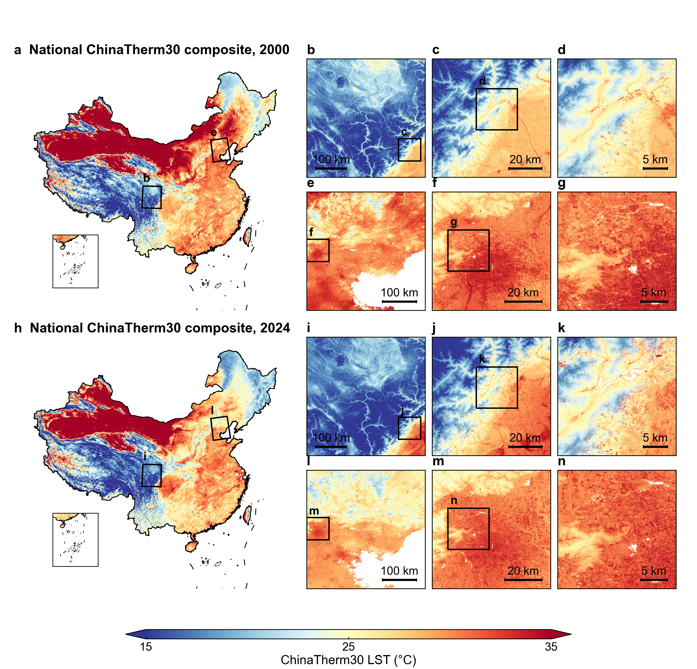

# ChinaTherm30

## Annual 30 m leaf-on daytime land surface temperature composites across China from 2000 to 2024

### 中国2000–2024年30 m叶盛期日间地表温度年度合成数据集

ChinaTherm30 is a nationwide, long-term land surface temperature record designed to connect continental-scale thermal patterns with local landscape detail. It provides 25 annual leaf-on daytime LST composites at 30 m resolution across China, with each year organized into 91 regular 4° × 4° tiles.

ChinaTherm30是一套兼顾全国长期覆盖与局地景观细节的地表温度数据记录，提供中国2000–2024年共25期、空间分辨率为30 m的叶盛期日间地表温度年度合成产品。每期数据由91个规则4° × 4°瓦片组成。

## Highlights / 项目亮点

- **25-year national record** — continuous annual coverage from 2000 to 2024. / **25年全国记录**——连续覆盖2000–2024年。
- **30 m spatial detail** — designed to represent fine-scale thermal patterns across cities, croplands, mountains and other heterogeneous landscapes. / **30 m空间细节**——刻画城市、农田、山地及其他异质景观中的精细热环境格局。
- **Consistent seasonal definition** — annual composites represent the daytime thermal state during China's leaf-on season. / **一致的季节定义**——年度合成反映中国叶盛期的日间地表热状态。
- **Cross-scale evaluation** — assessed using MODIS, Landsat, UAV thermal imagery and ground infrared-radiometer observations. / **跨尺度评价**——结合MODIS、Landsat、无人机热红外影像和地面红外辐射温度观测开展验证。
- **Open data and reproducible workflow** — the complete data record, interactive explorer and core production code are publicly accessible. / **开放数据与可复现流程**——完整数据、交互式浏览平台及核心生产代码均已公开。

## Explore ChinaTherm30 / 浏览与获取

- [Interactive ChinaTherm30 Explorer / ChinaTherm30在线浏览](https://ee-liangerzheng377.projects.earthengine.app/view/chinatherm30-explorer)
- [Complete GeoTIFF data record on ScienceDB / ScienceDB完整GeoTIFF数据](https://doi.org/10.57760/sciencedb.00zzg)
- [Core production code on Zenodo / Zenodo核心生产代码](https://doi.org/10.5281/zenodo.22894495)

## Paper and supporting resources / 论文与支撑材料

- [Manuscript / 论文正文](manuscript/main.pdf)
- [Supplementary information / 补充材料](manuscript/supplementary.pdf)
- [Main and supplementary figures / 正文与补充图件](figures/)
- [Machine-readable supplementary data / 机器可读补充数据](supplementary_data/)

## Scientific applications / 科学应用

ChinaTherm30 provides a consistent spatial foundation for long-term studies of land-surface thermal environments across China. Potential applications include urban heat analysis, agricultural and ecological monitoring, mountain-environment research, regional climate assessment and multiscale land-surface studies.

ChinaTherm30为中国陆地热环境的长期研究提供统一的高分辨率空间基础，可用于城市热环境、农业与生态监测、山地环境研究、区域气候评估及多尺度陆面过程分析。

## Team / 研究团队

- **Erzheng Liang** — Fudan University; The University of Hong Kong / 复旦大学；香港大学
- **Luoma Wan** — The University of Hong Kong / 香港大学
- **Yaotong Cai** — Southern University of Science and Technology / 南方科技大学
- **Feiyi Gao** — Harbin Institute of Technology / 哈尔滨工业大学（corresponding author / 通讯作者）
- **Ziheng Zhu** — Fudan University / 复旦大学（corresponding author / 通讯作者）

## Contact / 联系方式

- Feiyi Gao: <gaofy@hit.edu.cn>
- Ziheng Zhu: <zhuziheng@fudan.edu.cn>
- Erzheng Liang: <u3665916@connect.hku.hk>
